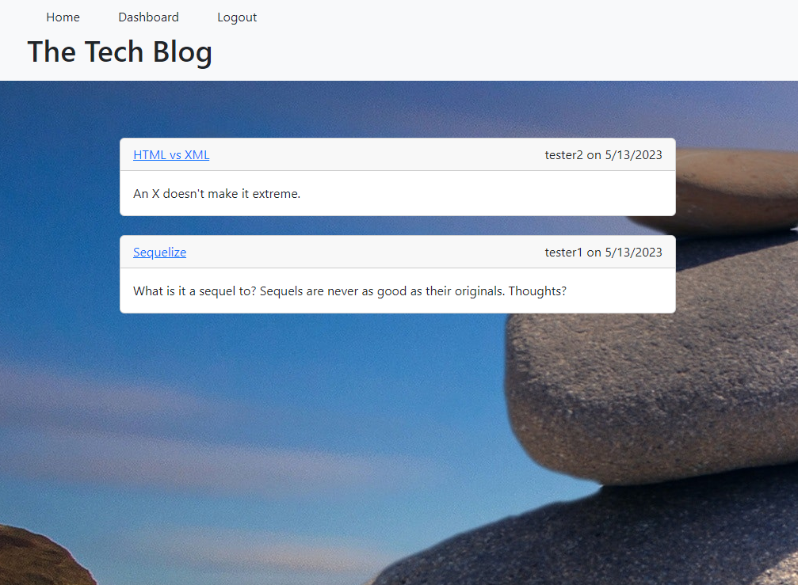

  

  # Tech Blog

  ## Description
  
  This repositoy contains the files for a blog app. Using Express.js API, Node JS, mysql 2, Sequelize, and Handlebars, users of this app can read, write, and store their blogs for themselves or others. The user can sign up, login, view other blogs, add commentary to blogs, or write their own think pieces. Blog writers can retrieve their blogs for editing as well.

  ## Table of Contents

- [Installation](#installation)
- [Usage](#usage)
- [License](#license)
- [Contributing](#contribution)
- [Tests](#tests)
- [Questions](#questions)

## Installation

Go to https://github.com/joaqsala/Tech-Blog-MVC and clone the repository. Open the contents in VS Code or other editor. In the terminal, install all dependencies using npm i. Log into mysql2 using your mysql -u root -p, and then enter your password. Start your database by entering source db/schema.sql. Then, log off of mysql2. (Optional, use npm run seed to start the database with seed data.) Enter node server.js and open the website on your brower using localhost:3001.

## Usage 

Follow the steps in the installation instructions posted above, and run node server.js. Open your web browser and enter localhost:3001 in the address bar and click enter. Any existing blogs will appear on the home page. To post your own blog, sign up by going to the login page and enter a username and password. Click on the dashboard and then click 'add blog' to write and post your blog. The dashboard can be used to write, edit, and delete your existing blogs. Users can go to the homepage to see and read existing blogs or click on a specific blog to see that blog and any associated comments. The user can also add their own comments.

## License

This project is covered under the MIT License.
 
  https://opensource.org/license/mit/

## Contribution

Contributions are always welcomed. Please submit a pull request.

## Tests

Test the app by adding and editing existing blogs into the database, and then viewing the results.

## Questions

For any questions, please feel free to reach out. 

Github username: https://github.com/joaqsala

Email: joaqsala@gmail.com
